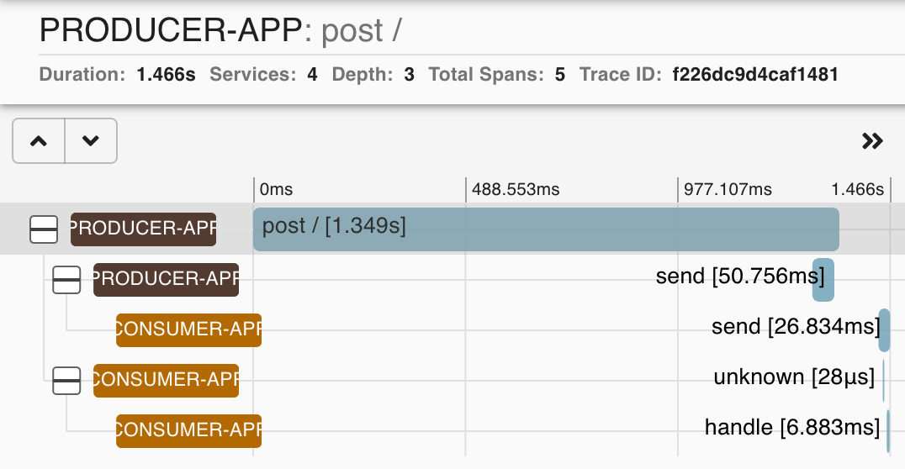

# SCSt Tracing

This repo contains a demo of using [Spring Cloud Stream](https://spring.io/projects/spring-cloud-stream) with 
[Micrometer Tracing](https://micrometer.io/docs/tracing).  Micrometer Tracing is a module that adds traceability to Spring MVC 
request/response and to messages sent via Spring Cloud Stream.  Tracing of requests, responses, and messages can span multiple, separate 
microservices.  This allows the tracing of a single request or message across a large system, which is invaluable to debugging complex 
applications that encompass many different microservices. 

Micrometer Tracing generates traces between 2 microservices (i.e., a "span") and across the entire end-to-end flow (i.e., a "trace").  It can also track flows 
that cross MVC/SCSt boundaries, allowing for tracing of hybrid applications that contain both HTTP request/response and messaging.  Tracing across 
messaging systems is supported via headers, which will work with most SCSt binders.  Most HTTP clients, such as Feign, WebClient, and RestTemplate 
are supported.

Tracing uses generated UUIDs to identify specific spans and traces.

Micrometer Tracing can output traces in a number of ways, including:

- via logging
- via Elasticsearch
- via Zipkin (a tool that visualizes the traces and spans)
- via Wavefront

## Logging

When Micrometer Tracing is included in the build dependencies, and a change to the logging pattern, it automatically includes the span and trace UUIDs.  The UUIDs 
can be used to examine the logs to determine the root cause of a failure, which may have been triggered deep in a system but not noticed until the 
call reaches a higher level.  The specific log output associated with the suspect span or trace can be located by grepping the logs for each 
component involved in the trace or span.

## Elasticsearch

In a large system going to the logs for each component is very difficult, so the use of the ELK stack (Elasticsearch, Logstash, and Kibana) in 
large environments is very common.  While not specific to Micrometer Tracing, the combination of Micrometer Tracing and Elasticsearch is a very powerful tool to see the 
sequence of events that led to the error.  Simply search the Elasticsearch indexes for the trace or span UUID in question to see all of the log 
output for the trace or span in one place.  This can also show the sequence of events, which may be important in determining what caused the problem.

Note that other log aggregation tools, such as Splunk, will also work since the UUIDs are simply part of the log output.

Elasticsearch is not used in this demo.

## Zipkin

Zipkin is a tool to visualize traces and spans.  For a given trace it shows the components and spans involved in the trace.  It also shows where 
sequential and parallel flows occur and their relationship.  This is a very powerful tool since it visualizes the entire trace, which spans are 
involved, which components participate in the span and trace, and potentially where the error was first recorded.

## Setting up Environment

### JDK

JDK 17+ must be installed to run the demo.

### Kafka

This demo uses Kafka, so the first step is to get it running locally.  On Mac use Brew: `brew install kafka`.  This installs the Apache version.  
Kafka uses Zookeeper for cluster management, which is included with the Brew install.  Kafka requires JDK 1.8+.

To get the startup information use `brew info kafka`.  Note that the Brew service (`brew services start kafka`) is sometimes flaky, and doesn't
show what Kafka and Zookeeper are doing, so generally it's best to use the non-background services.  However, the recommended non-background
method shown in the info isn't always reliable either.  The reliable way to run Kafka is to run Zookeeper in one terminal:

`zookeeper-server-start /usr/local/etc/kafka/zookeeper.properties`

Once that is up and running start the Kafka broker:

`kafka-server-start /usr/local/etc/kafka/server.properties`

Topics are automatically created by the SCSt applications when they are started.

### Zipkin

Zipkin is deployed as a bootable JAR.  Either run it directly or use Docker.  Follow the instructions [here](https://zipkin.io/pages/quickstart).  
By default no database or other external dependencies are required (in production a database would be used to store the traces).

## Running Demo

The apps can be started in an IDE or via Gradle:

Terminal #1:
`./gradlew :consumer:bootRun`

Terminal #2:
`./gradlew :producer:bootRun`

To post data to the producer, run this in another terminal:

`./gradlew :producer:postData`

Now open the [Zipkin UI](http://localhost:9411/zipkin/).  Click on the "Run Query" button.  There should be 3 traces.
